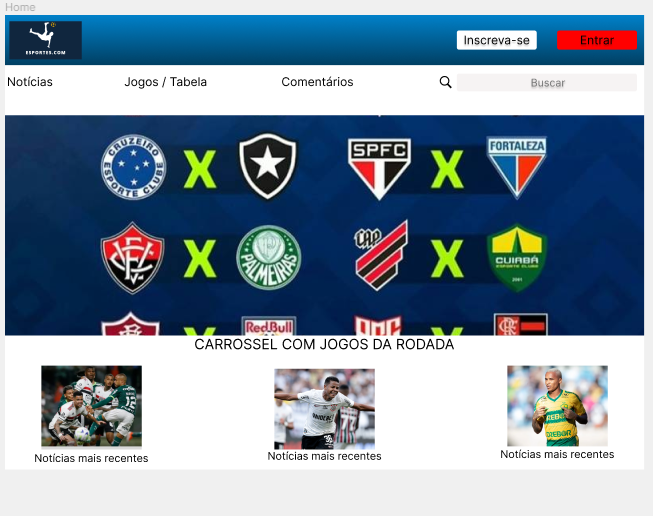
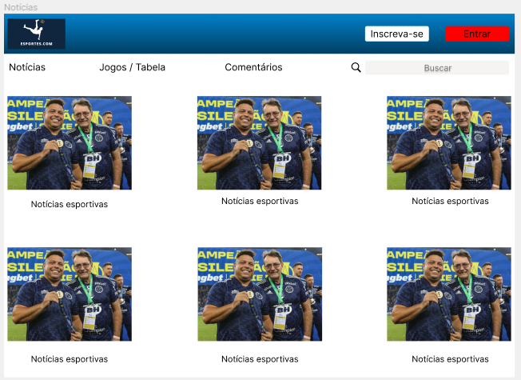
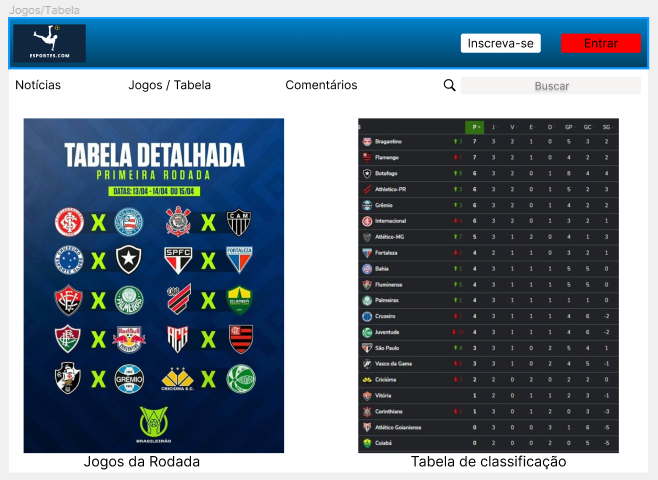
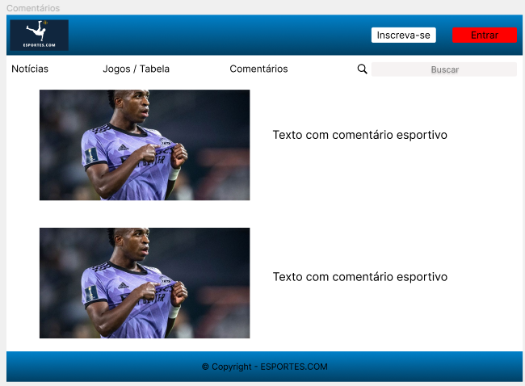
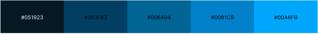

# Este é o layout feito no Figma do Projeto Web. O tema da minha página é Site esportivo de futebol.

## Esta é a pagina inicial:

## Esta é a pagina de notícias:

## Esta é a página Jogos / Tabela:

## Esta é a página Comentários com o rodapé:

## Esta é a paleta de cores:

## Este é o logo da página:

## Esta é a fonte utilizada na página:

https://fonts.google.com/specimen/Inter?query=inter